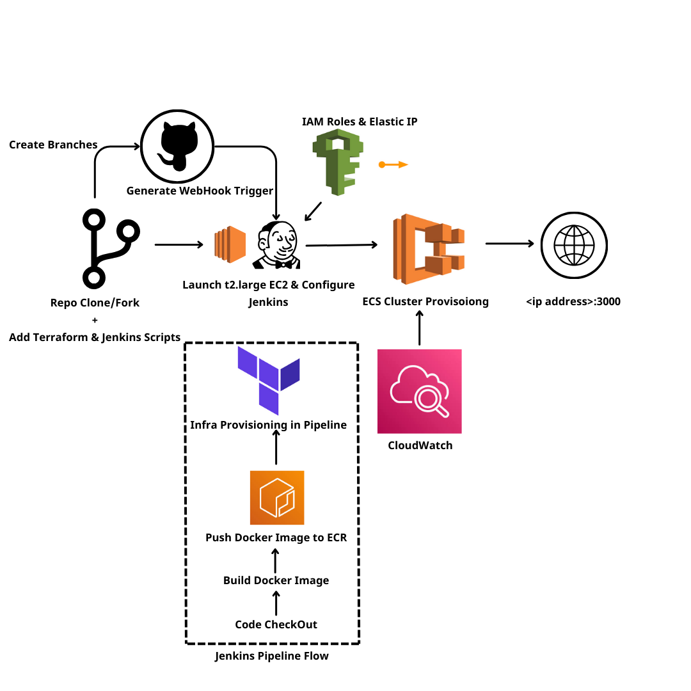

# Logo Server


TESTING NLB FOR ECS STATIC IP 


A simple Express.js web server that serves the Swayatt logo image.

## What is this app?

This is a lightweight Node.js application built with Express.js that serves a single logo image (`logoswayatt.png`) when accessed through a web browser. When you visit the root URL, the server responds by displaying the Swayatt logo.

## Prerequisites

- Node.js (version 12 or higher)
- npm (Node Package Manager)

## Installation

1. Clone or download this repository
2. Navigate to the project directory:
   ```bash
   cd "devops task"
   ```
3. Install dependencies:
   ```bash
   npm install
   ```

## How to Start the App

Run the following command:
```bash
npm start
```

The server will start and display:
```
Server running on http://localhost:3000
```

## Usage

Once the server is running, open your web browser and navigate to:
```
http://localhost:3000
```

You will see the Swayatt logo displayed in your browser.

## Project Structure

```
├── app.js              # Main server file
├── package.json        # Project dependencies and scripts
├── logoswayatt.png     # Logo image file
└── README.md          # This file
```

## Technical Details

- **Framework**: Express.js
- **Port**: 3000
- **Endpoint**: GET `/` - serves the logo image
- **File served**: `logoswayatt.png`


<div align="center">
  

  <br>
</div>

<br />

# Deploy Express App on Cloud using Jenkins & Terraform on ECS Project!

### **Phase 1: Initial Setup and Deployment**

**Step 1: Launch EC2 (Ubuntu 22.04):**

- Provision an EC2 instance on AWS with Ubuntu 22.04.
- Connect to the instance using SSH.

**Step 2: Clone the Code:**

- Update all the packages and then clone the code.
- Clone your application's code repository onto the EC2 instance:
    
    ```bash
    git clone https://github.com/gajenderyadavv/devops-task.git
    ```
 - Add Jenkins and Terraform Scripts.
   
**Step 3: Install Docker and Run the App Using a Container:**

- Set up Docker on the EC2 instance:
    
    ```bash
curl -O https://gist.githubusercontent.com/gajenderyadavv/5acbdf612024965f3172d77d811a3d66/raw/2f823a0ac5aedd2410164a88b24d6591e4c21b2a/install-docker-debain12

    ```
    
- Build and run your application using Docker containers:
    
    ```bash
    docker build -t netflix .
    docker run -d --name devops-task -d -p 3000:3000 devops-task:latest
    
    #to delete
    docker stop <containerid>
    docker rmi -f devops-task
    ```
    Ensure to enable inbound rule for 3000

**Step 4: Install Jenkins and Configure Docker, Terraform, AWS, Github.**

    - Install Jenkins on the EC2 instance to automate deployment:
    Install Java
    
    ```bash
    sudo apt update
    sudo apt install fontconfig openjdk-17-jre
    java -version
    openjdk version "17.0.8" 2023-07-18
    OpenJDK Runtime Environment (build 17.0.8+7-Debian-1deb12u1)
    OpenJDK 64-Bit Server VM (build 17.0.8+7-Debian-1deb12u1, mixed mode, sharing)
    
    #jenkins
    sudo wget -O /usr/share/keyrings/jenkins-keyring.asc \
    https://pkg.jenkins.io/debian-stable/jenkins.io-2023.key
    echo deb [signed-by=/usr/share/keyrings/jenkins-keyring.asc] \
    https://pkg.jenkins.io/debian-stable binary/ | sudo tee \
    /etc/apt/sources.list.d/jenkins.list > /dev/null
    sudo apt-get update
    sudo apt-get install jenkins
    sudo systemctl start jenkins
    sudo systemctl enable jenkins
    ```
    
    - Access Jenkins in a web browser using the public IP of your EC2 instance. Ensure to enable inbound rule for 8000..


      --Install plugins of AWS, Terraform, Docker, Github

      -- Create a new Pipeline job and configure to jenkins job setup.

      -- Configure AWS Credentials in Jenkins Global level.
      
      -- Manage Pipeline from SCM (Source Control Management) → Jenkins to read the Jenkinsfile directly from GitHub.

      -- Ensure to provide the Sufficient role to Jenkins CI IAM user for provision infra using Terraform.

      -- Create the another branch as dev in the github branches for better branching strategies.

      -- Push any changes to /main brach will automatically deploy the changes in AWS ECS.

      -- TO get the IP Adress go to the AWS ECS Console->Cluster->Tasks->Under that you will find the Public IP.

      -- Access <ip adress>:3000 to access you application.
      
 

